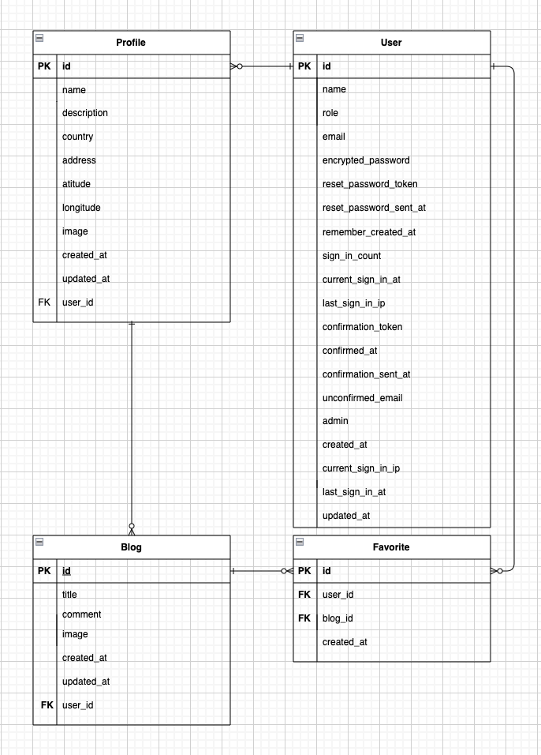
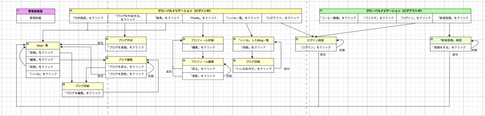

# 開発言語
- Ruby 3.0.1
- rails 6.1.6

# 就職Termの技術
- お気に入り機能
- `gem devise`

# カリキュラム外の技術
- `gem gmaps4rails`
- `gem geocoder`
- `gem ransack`

# 実行手順
$ git clone git@github.com:2303-DIC-MEG/Coffee_farm.git  
$ cd Coffee_farm   
$ bundle install   
$ rails db:create && rails db:migrate   
$ rail s  

# カタログ設計
https://docs.google.com/spreadsheets/d/1uw1sRsO3pHZiM1z-FPtfucvGWSFZT8jBtGCEkVa5dX8/edit?usp=sharing
# テーブル定義書
https://docs.google.com/spreadsheets/d/1uw1sRsO3pHZiM1z-FPtfucvGWSFZT8jBtGCEkVa5dX8/edit?usp=sharing
# ワイヤーフレーム
https://drive.google.com/file/d/1dXAY04oY8hYsxuGpP-FUJD6_3yLjJlFs/view?usp=sharing
# ER図

# 画面遷移図
